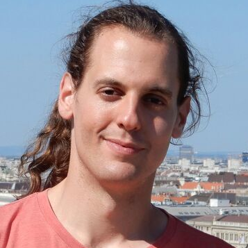

I am Philipp.
------

I am a crystallographer. - I am interested in e.g. machine learning, approximation theory, automation, philosophy. Please contact me for discussions.

[find me on linkedin!](https://jo.linkedin.com/in/philipp-hans-a5b9681a7?trk=people-guest_people_search-card)

[find me on ORCID!](https://orcid.org/0000-0002-3505-9884)

[find me on medium.com!](https://medium.com/@phlpphns)

------

[European Crystallographic Association](https://ecanews.org/)
------

[Inclusion – not only in crystals: spotting and overcoming potential obstacles](https://phlpphns.github.io/ECM34_MS_inclusion/) - a microsymposium at the ECM34 (34th European Crystallographic Meeting)

[SIG-15 Crystallography in Art and Cultural Heritage](https://ecanews.org/groups/sig-15-crystallography-in-art-and-cultural-heritage/)

[ECA Individual Member Forum](https://ecanews.org/groups/eca-im-forum/)

[Rust](https://www.rust-lang.org/)
------

<!---
[Rust] / [WebAssembly]
----------------------

* [fractx-wasm-demo](https://phlpphns.github.io/test_submodule) - a [Mandelbrot](https://en.wikipedia.org/wiki/Mandelbrot_set) set WebAssembly [demo](/rust-fractx-wasm-demo/) in Rust. Thank you to [royaltm](https://royaltm.github.io/), whose repo I copied for learning reasons.
--->
