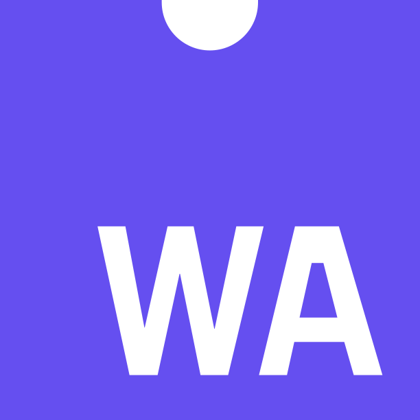

[about me]
------

* [phlpphns](https://phlpphns.github.io) - this is a link to my github account. Maybe you find something ineresting there, for example a template for CV and a thesis in LaTeX. Also, I provide a couple of tools for scientific data analyis there (more to come!).

[Rust]
------

[European Crystallographic Association]
[Inclusion – not only in crystals: spotting and overcoming potential obstacles](https://phlpphns.github.io/ECM34_MS_inclusion/) - a microsymposium at the ECM34 (34th European Crystallographic Meeting)

<!---
[Rust] / [WebAssembly]
----------------------

* [fractx-wasm-demo](https://phlpphns.github.io/test_submodule) - a [Mandelbrot](https://en.wikipedia.org/wiki/Mandelbrot_set) set WebAssembly [demo](/rust-fractx-wasm-demo/) in Rust. Thank you to [royaltm](https://royaltm.github.io/), whose repo I copied for learning reasons.
--->
